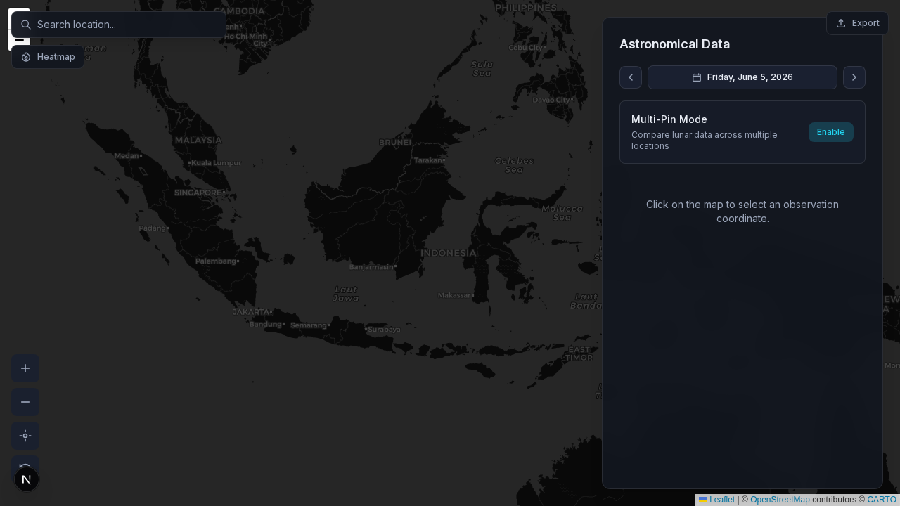
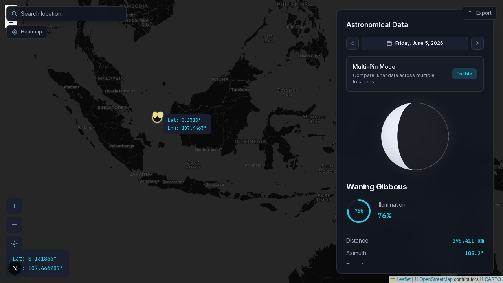
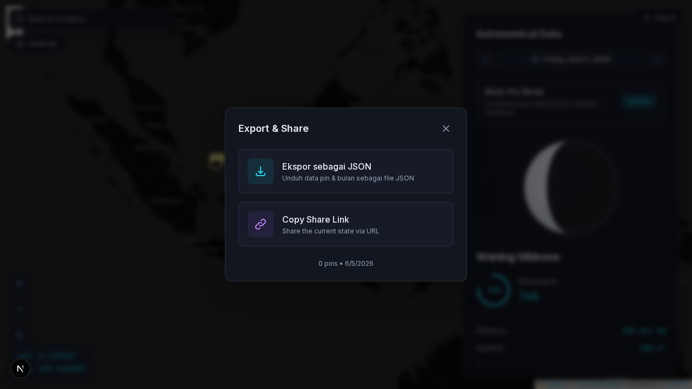
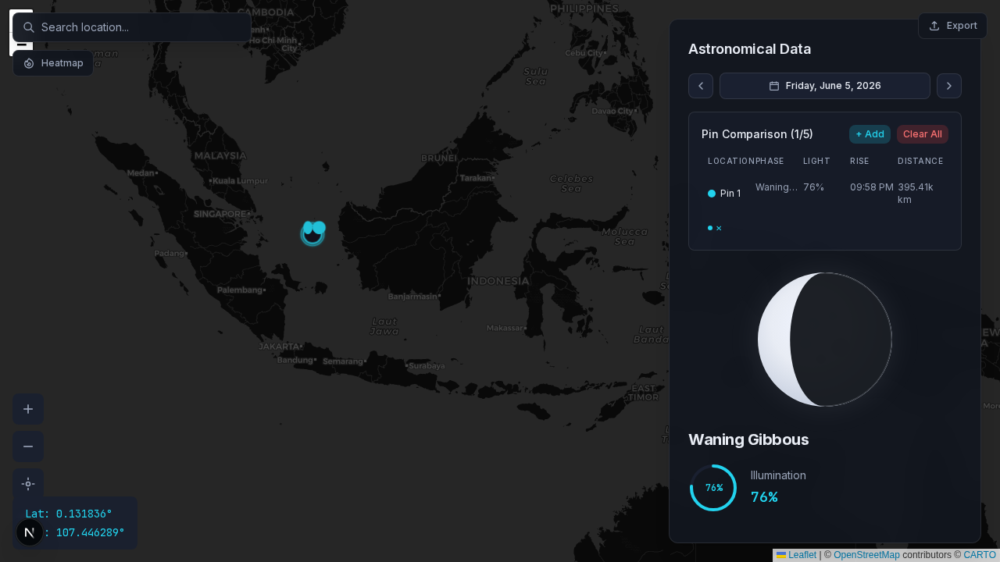

# MoonPhase GIS

Geospatial lunar phase explorer built with **Next.js 15**, **React Leaflet**, and **SunCalc**. Click anywhere on a dark-themed world map to view real-time astronomical data for that location.



## Features

| Feature | Description |
|---------|-------------|
| **Interactive Map** | Full-screen CartoDB dark tiles with click-to-select coordinates |
| **Lunar Data Panel** | Phase, illumination, distance, azimuth, elevation, moonrise/moonset |
| **Moon Visualizer** | SVG moon phase animation with illumination arc |
| **Date Selector** | Navigate past and future dates to explore lunar cycles |
| **Multi-Pin Mode** | Compare lunar data across up to 5 locations |
| **Heatmap Overlay** | Visualize lunar illumination coverage on the map |
| **Location Search** | Geocoding via OpenStreetMap Nominatim |
| **Export & Share** | Download JSON or copy an encoded share URL |
| **Onboarding Tour** | First-visit guided walkthrough |
| **PWA Ready** | Service worker, manifest, and offline fallback page |

## Screenshots

| Home | Map with Data | Export Modal | Multi-Pin |
|------|---------------|--------------|-----------|
|  |  |  |  |

## Quick Start

```bash
npm install
npm run dev
```

Open [http://localhost:3000](http://localhost:3000). Click the map to place a pin and view lunar data in the sidebar.

## Scripts

| Command | Description |
|---------|-------------|
| `npm run dev` | Start development server |
| `npm run build` | Production build |
| `npm run start` | Start production server |
| `npm run lint` | Run ESLint |
| `npm run format` | Format with Prettier |
| `npm test` | Run Jest unit tests |
| `npm run test:coverage` | Unit tests with coverage report |
| `npm run test:e2e` | Run Playwright end-to-end tests |
| `npm run test:e2e:ui` | Playwright interactive UI mode |

## Testing

### Unit Tests (Jest)

```bash
npm test
```

Covers moon calculations, state codec, multi-pin hook, and UI components.

### End-to-End Tests (Playwright)

```bash
npx playwright install chromium   # first time only
npm run test:e2e
```

E2E tests verify map loading, search, date selector, export modal, multi-pin mode, heatmap toggle, and capture documentation screenshots.

## Project Structure

```
src/
├── app/                  # Next.js App Router (page, layout)
├── components/
│   ├── Map/              # Leaflet map, markers, heatmap, search
│   ├── Sidebar/          # Moon info, visualizer, timeline, comparison
│   └── UI/               # Panel shell, date picker, export, onboarding
├── hooks/                # useMapSync, useMoonData, useMultiPin
├── lib/                  # moonCalc, stateCodec, constants
└── types/                # TypeScript interfaces
docs/                     # Documentation
prd/                      # Product requirements (5 phases)
e2e/                      # Playwright tests
```

## Documentation

| Document | Description |
|----------|-------------|
| [docs/README.md](docs/README.md) | Documentation index |
| [docs/getting-started.md](docs/getting-started.md) | Setup and usage guide |
| [docs/architecture.md](docs/architecture.md) | System architecture |
| [docs/design-system.md](docs/design-system.md) | Visual design tokens |
| [docs/testing.md](docs/testing.md) | Testing strategy |
| [prd/](prd/) | Product requirements (Phases 1–5) |

## Tech Stack

- **Framework:** Next.js 15 (App Router), React 19, TypeScript
- **Map:** Leaflet, react-leaflet, CartoDB Dark Matter tiles
- **Astronomy:** suncalc3 (client-side moon calculations)
- **Styling:** Tailwind CSS (space-dark design system)
- **Testing:** Jest, React Testing Library, Playwright
- **CI:** GitHub Actions

## Commit Messages

Follow [Conventional Commits](https://www.conventionalcommits.org/). Config: `commitlint.config.js`.

## License

Private — MoonPhase GIS project.
